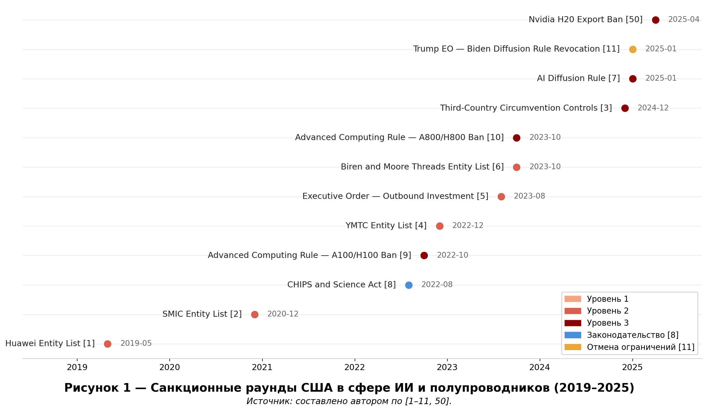
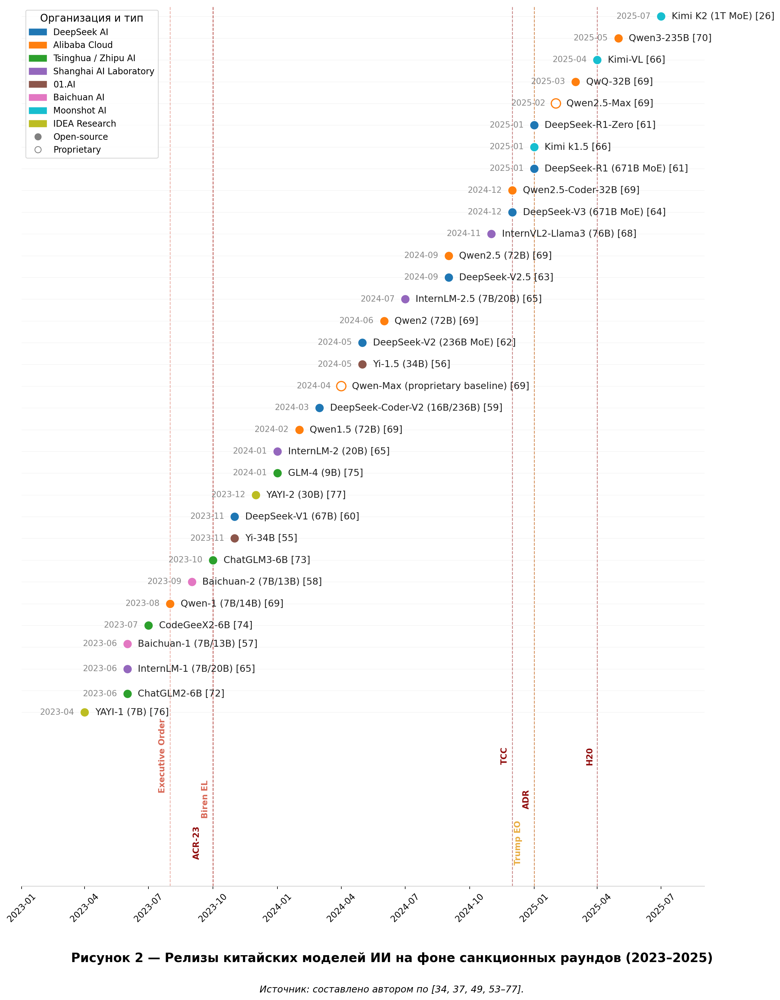
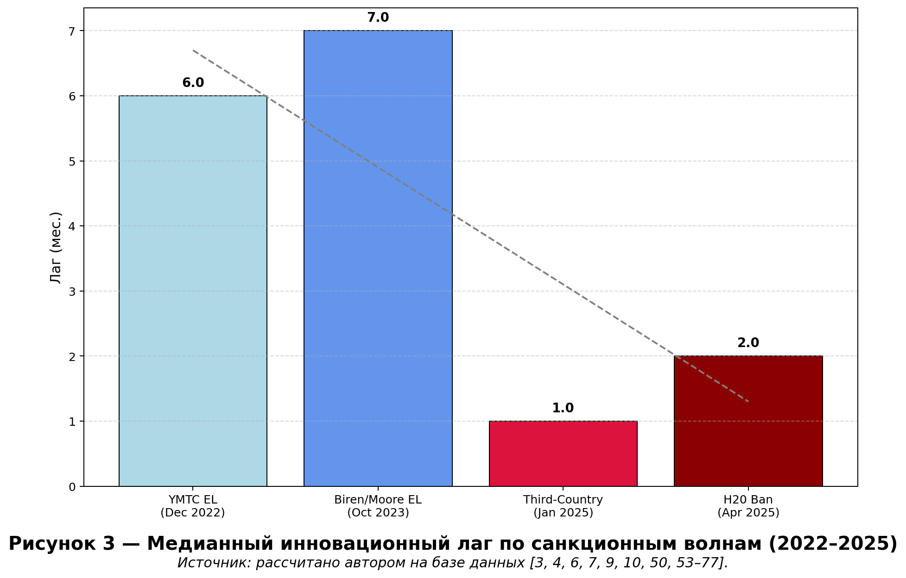
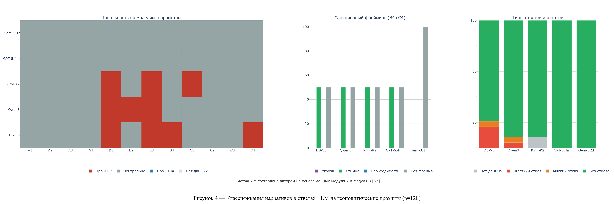

# OPEN SOURCE МОДЕЛИ ИСКУССТВЕННОГО ИНТЕЛЛЕКТА КАК АСИММЕТРИЧЕСКИЙ ОТВЕТ КИТАЯ НА ЭКСПОРТНЫЕ ОГРАНИЧЕНИЯ США


[[English version](README.en.md)]

Исследование доказывает, что американские санкции против китайской ИИ-отрасли парадоксально ускорили её развитие. Разработаны три оригинальных аналитических модуля на Python для количественного и качественного анализа динамики ИИ-релизов в КНР и реального API-опроса 5 передовых LLM. Полученные результаты демонстрируют формирование Китаем суверенных программных экосистем в условиях жесткого аппаратного дефицита.

---

## 📊 Ключевые результаты

| Показатель | Значение | Контекст / Детали |
| :--- | :--- | :--- |
| **Медианный инновационный лаг** | **4,0 месяца** | По всей выборке (33 релиза, 2019–2026 гг.) |
| **Сокращение временного лага** | **7 мес. (2023) → 1–2 мес. (2025)** | Переход от реактивной модели к проактивной |
| **Стоимость обучения DeepSeek-R1** | **<$6 млн** | Сравнение: GPT-4 ~$78 млн, Gemini ~$191 млн |
| **Доля Qwen на Hugging Face** | **39%** | Базовая модель для fine-tuning (I пол. 2025) |
| **Масштаб API-опроса моделей** | **5 моделей / 12 промптов** | 120 ответов (DeepSeek V3, Qwen3, Kimi K2, GPT-5 mini, Gemini Flash) |

---

## 💡 Авторские концепты

> [!NOTE]
> В рамках исследования сформулированы четыре теоретических концепта, описывающих специфику китайского ответа на внешние ограничения:

*   **Counter-chokepoints** — программные узлы глобальной зависимости, которые Китай создаёт зеркально в ответ на американский аппаратный контроль.
*   **Coercive opening** («принудительное открытие») — изоляция от оборудования вынуждает публиковать open-weight модели, непреднамеренно создавая глобальную зависимость от китайского кода.
*   **Технологическое эхо** — системный паттерн: каждому санкционному удару следует волна релизов с сокращающимся лагом.
*   **Discursive dependency** — страны Глобального Юга, используя китайские LLM, получают не только технологию, но и встроенную систему геополитических интерпретаций.

---

## 🗂 Структура репозитория

Проект разделен на три аналитических модуля:

*   **`data/module1/` (ХроноБД):** База данных санкционных пакетов и релизов китайских моделей (2019–2026). Содержит расчеты инновационных лагов.
*   **`data/module2/` (API-опрос):** Протоколы и результаты опроса ведущих LLM (DeepSeek-V3, Qwen3, Kimi K2, GPT-5, Gemini) по 12 геополитическим темам.
*   **`data/module3/` (Классификация и аудит):** Результаты автоматизированной классификации ответов по тональности, фреймингу санкций и типам отказа.
*   **`src/module1/`:** Скрипты для сбора данных санкций и моделей, расчета инновационных лагов и построения базовой временной шкалы (`timeline_builder.py`, `visualize.py`).
*   **`src/module2/`:** Программный интерфейс для автоматизированного API-опроса выбранных LLM с использованием OpenRouter API (`main.py`).
*   **`src/module3/`:** Программный комплекс на Python для обработки данных, проведения аудита (`audit_data.py`), классификации (`classifier.py`) и генерации аналитических визуализаций (`visualize.py`).
*   **`output/`:** Итоговые графические отчеты и визуализированные результаты исследования.
*   **`docs/BIBLIOGRAPHY.md`:** Исчерпывающий список источников и литературы.

---

## 📈 Визуализации

### Временная шкала санкций и релизов


### Распределение релизов по годам


### Динамика инновационных лагов по волнам


### Анализ нарративов и когнитивного позиционирования LLM


---

## ⚙️ Технический стек

*   **Язык программирования:** Python 3.11
*   **Анализ данных:** pandas
*   **Визуализация:** Plotly, Matplotlib
*   **Интеграция с моделями ИИ:** OpenRouter API, OpenAI SDK
*   **База данных:** Supabase
*   **Платформы и источники:** GitHub, Hugging Face, arXiv

---

## 🚀 Быстрый старт

### Установка

1. Клонируйте репозиторий:
   ```bash
   git clone https://github.com/Nek1yZakhar/Geopolitical_LLM_Analysis.git
   cd Geopolitical_LLM_Analysis
   ```

2. Установите зависимости:
   ```bash
   pip install -r requirements.txt
   ```

3. Настройте ключи доступа (для запуска модулей опроса):
   * Создайте файл `.env` в корневой директории.
   * Добавьте ваш API ключ:
     ```env
     OPENROUTER_API_KEY=your_openrouter_api_key_here
     ```

### Запуск анализа

Для генерации актуальных визуализаций (приложения к курсовой работе):
```bash
python src/module3/visualize.py
```

---

## Методология (Module 3: Когнитивное измерение)

Сравнительный анализ проводится по трем осям:
1. **Tone (Тональность):** `pro_CN` / `neutral` / `pro_US`.
2. **Sanction Frame:** `threat` (угроза) / `stimulus` (стимул) / `necessity` (необходимость).
3. **Refusal Type:** `hard_refusal` / `soft_refusal` / `no_refusal`.

Нивелирование "галлюцинаций" достигается за счет статистической обработки множественных запросов через API и перекрестной верификации с помощью LLM-классификаторов.

---

**Междисциплинарная курсовая работа (2026)**  
*Тема:* «Open-source модели ИИ как асимметричный ответ Китая на экспортные ограничения США» (Оценка: **Отлично**)  
*Студент:* Матвейчук Захар Евгеньевич (Группа 07331-ДБ, Направление: 41.03.05 «Международные отношения»)  
*Институция:* Иркутский государственный университет (ФГБОУ ВО «ИГУ»), Исторический факультет  
*Руководитель:* проф. Кузнецов С. И.  
*Иркутск, 2026*
